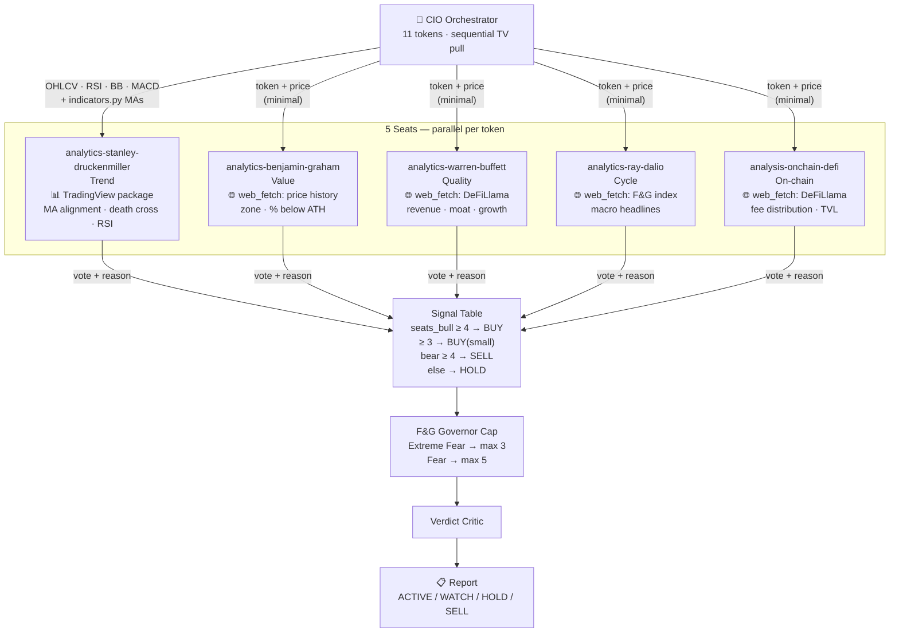

# Crypto Advisor

Analyze every token in the universe **sequentially** (single shared chart slot) → assemble one data package per token → run a 5-seat quorum in parallel → decide BUY/SELL/HOLD → Verdict Critic → Citation Validator → print the report.

> Educational analysis, not financial advice. No leverage. Ever.

## Architecture

Each seat owns its own data sources. The orchestrator fetches TradingView data only because
subagents cannot access MCP tools — that package goes to the Trend seat only. All other seats
independently fetch what they need via web_fetch / DeFiLlama / F&G APIs.



## Quickstart

### Default daily run
```
Run the crypto advisor
```
Analyzes the default universe, pulls live TradingView data, runs a 5-seat quorum per token, prints the 3-block report (signal table + plain-English verdicts + ranked news). **Attach a TradingView screenshot for each token.**

### Custom token set
```
Run the crypto advisor on: TON, JUP, HYPE
```

### Full prompt (copy-paste for any session)
```
Invoke the crypto-advisor skill. Token universe for this run: [TOKEN1, TOKEN2, ...].
Follow all skill instructions:
- chart_get_state → dedup indicators → set_symbol → D OHLCV (365 summary + 210 bars) → study values → W OHLCV → capture_screenshot
- Compute MAs via .agents/skills/crypto-advisor/scripts/indicators.py
- Run 5-seat quorum inline (on-chain, sentiment, macro, order-flow, narrative)
- Narrative seat: web-fetch ≥3 sources, rank T1/T2/T3, quote exact sentences
- Print 3-block report: signal table | plain-English verdicts | news sources
- Attach TradingView screenshot for each token in the reply
Educational, not financial advice.
```

### Scheduling (continuous)
```
/loop interval=6h    ← re-runs every 6 hours, resumes from last pending todo
/stop                ← cancel the loop
```

---

## Token universe

**STALENESS RULE — every row:** Any tokenomics claim (fee switch, buyback, burn, staking yield, revenue accrual, governance status) is a live fact that changes via governance vote. Verify it with a live `web_fetch` before using it in any verdict or add/remove decision — never from memory. Full verification procedure: §On-chain seat (Step 1d).

| Token | Rationale | TradingView symbol |
|-------|-----------|-------------------|
| BTC   | Foundational monetary layer; largest market cap | `BINANCE:BTCUSDT` |
| ETH   | Smart-contract platform; stablecoin infra (53% of $300B market) | `BINANCE:ETHUSDT` |
| SOL   | High-performance L1; Solana DeFi base layer | `BINANCE:SOLUSDT` |
| TON   | Telegram L1; 900M-user payment infra (Wallet + USDT); watch Durov legal status | `BINANCE:TONUSDT` |
| HYPE  | Hyperliquid perp DEX; 97% revenue auto-buyback hardcoded; real cashflow token | `OKX:HYPEUSDT` |
| AAVE  | Leading DeFi lending protocol; real yield from spreads + GHO fees; >$1T cumulative loans | `BINANCE:AAVEUSDT` |
| JUP   | Jupiter — Solana DeFi super-app (perps, lending, launchpad, DCA, staking); 15+ fee streams | `BINANCE:JUPUSDT` |
| UNI   | Uniswap — fee switch activated Dec 2025 (UNIfication, 99.9% vote); trading fees → burn UNI via Firepit; $1B+/yr fee base; expanding to all v3 + 8 chains | `BINANCE:UNIUSDT` |
| AERO  | Aerodrome Finance — Base chain DEX; real trading fees; ve(3,3) tokenomics with revenue accrual | `BINANCE:AEROUSDT` |
| PUMP  | Pump.fun — Solana meme launchpad; reflexive fees; track for cycle timing signal | `OKX:PUMPUSDT` |
| LINK  | Oracle network; backbone of RWA tokenization (Swift, Euroclear, JPMorgan, UBS) | `BINANCE:LINKUSDT` |

---

## Hard constraints — read before running (these dictate the whole design)

1. **TradingView MCP tools live ONLY in the orchestrator (you).** Subagents get a fresh toolset with **no** `tradingview-*` tools, so YOU pull every chart datum. Never tell a subagent to "pull TradingView data" — it cannot. Subagents only *receive* an assembled data package and reason over it (they may still web-fetch F&G / on-chain).
2. **The chart is a single shared symbol slot.** `chart_set_symbol` mutates the one global chart — two tokens cannot be pulled at once. **The data loop is strictly sequential, one token at a time.** Track progress in `todos` so a `/loop` or interrupted run resumes cleanly.
3. **Read every indicator from TradingView — don't recompute it.** `data_get_study_values` returns RSI(14), Bollinger(20,2), MACD(12,26,9), Volume at standard lengths — use them verbatim. The only gap is moving averages: `chart_manage_indicator` ignores the MA `length` input and has no `update` action. So EMA20 / SMA50 / SMA200 / 200-week-MA — and only those — are computed by `scripts/indicators.py` from the MCP's **own** returned closes (the data source stays 100% TradingView).

TradingView symbol mapping: `BINANCE:{TOKEN}USDT`. If a symbol is missing on Binance, try `OKX:{TOKEN}USDT`.

---

## Step 0 — Seed the todo list (one row per token)

```sql
INSERT INTO todos (id, title, description) VALUES
 ('tok-BTC', 'Analyzing BTC',  'Pull TradingView D/W OHLCV+studies, compute pkg, run 5-seat quorum, decide signal'),
 ('tok-ETH', 'Analyzing ETH',  'idem'),
 ('tok-SOL', 'Analyzing SOL',  'idem'),
 ('tok-TON', 'Analyzing TON',  'idem — watch Durov legal proceedings'),
 ('tok-HYPE','Analyzing HYPE', 'idem — use OKX:HYPEUSDT'),
 ('tok-AAVE','Analyzing AAVE', 'idem'),
 ('tok-JUP', 'Analyzing JUP',  'idem — Jupiter Solana DeFi super-app'),
 ('tok-UNI', 'Analyzing UNI',  'idem — fee switch live Dec 2025; burns via Firepit; $1B+/yr fee base'),
 ('tok-AERO','Analyzing AERO', 'idem — Aerodrome Finance Base DEX, try BINANCE:AEROUSDT'),
 ('tok-PUMP','Analyzing PUMP', 'idem — pump.fun token, try OKX:PUMPUSDT'),
 ('tok-LINK','Analyzing LINK', 'idem');
```

Create the verdict tracker once:

```sql
CREATE TABLE IF NOT EXISTS token_analysis (
  symbol TEXT PRIMARY KEY, quorum_verdict TEXT, dominant_zone TEXT,
  seats_bull INTEGER, seats_bear INTEGER, key_support REAL, key_resistance REAL,
  confidence TEXT, signal TEXT, status TEXT DEFAULT 'pending');
```

---

## Step 0.5 — Create the run artifact directory

Run once before the per-token loop. Every token gets its own subdirectory `$RUN_DIR/{TOKEN}/`.

```bash
RUN_DIR=".cache/crypto-advisor/research/$(date +%Y-%m-%d_%H-%M)"
mkdir -p "$RUN_DIR"
echo "Artifacts: $RUN_DIR"
```

---

## Step 1 — Sequential per-token loop (orchestrator only; do NOT parallelize the data pull)

Pick the next `pending` todo, `UPDATE todos SET status='in_progress'`, then for that token:

**1a. Pull TradingView data (MCP, this session).** Call `tradingview-chart_get_state` and inspect `studies`. **Add a study only if its name is NOT already present** — a duplicate pushes a second identical series and produces duplicate rows in `data_get_study_values`. Remove extras with `chart_manage_indicator action=remove`. Required studies (add only if absent): **Relative Strength Index**, **Bollinger Bands**, **MACD**. Do NOT add length-N EMAs (length input ignored — constraint 3). Volume is always present.

```
tradingview-chart_get_state                                → inspect studies list; deduplicate before proceeding
tradingview-chart_set_symbol     symbol="BINANCE:{TOKEN}USDT"
tradingview-chart_set_timeframe  timeframe="D"
tradingview-data_get_ohlcv       count=365 summary=true   → 52w high/low + avg volume
tradingview-data_get_ohlcv       count=210 summary=false  → >=200 daily closes (for SMA200)
tradingview-data_get_study_values                          → RSI(14), BB(20,2), MACD, Volume (one of each)
tradingview-chart_set_timeframe  timeframe="W"
tradingview-data_get_ohlcv       count=210 summary=false  → weekly closes (for 200-week MA)
tradingview-chart_set_timeframe  timeframe="D"             → reset to daily
tradingview-capture_screenshot                             → save screenshot; then call view tool on the returned file_path to embed the image inline in your reply for this token
```

**1b. Read indicators from TradingView; compute only the moving averages.** Take RSI(14), Bollinger(20,2), MACD line/signal/hist, Volume from `data_get_study_values` verbatim; 52w high/low + avg volume from the daily `summary=true` pull. Then fill the MA gap:
```bash
/Users/engineer/.venv/bin/python3 .agents/skills/crypto-advisor/scripts/indicators.py /tmp/{TOKEN}.json
```
Helper input: `{"symbol","price","daily_closes":[...],"weekly_closes":[...]}`. Output: EMA20, SMA50, SMA200, 200-week MA, and the death cross (classic SMA50/SMA200, exact). It does not recompute RSI/BB/MACD.

**DATA SUFFICIENCY RULE — 200wMA only:** Count the weekly closes from `tradingview-data_get_ohlcv count=210 timeframe=W`.

If `weekly_closes < 200`:
- Set `200wMA = INSUFFICIENT` — do NOT compute or print a 200wMA value.
- Compute the longest available weekly MA and label it `~{N}wk MA proxy: ${value}` — never "200wMA".
- Classify zone from % off all-time high + distance from the proxy MA. A token -70% from ATH and below its proxy MA is DEEP_VALUE.
- Do NOT force zone = UNKNOWN. Do NOT block BUY or BUY(small) on a missing 200wMA.
- Cap the signal at **BUY (small)** maximum.
- Add a plain-English note: e.g. "4-year moving average not yet available (only N months of price history) — using shorter-term trend as proxy."

If `weekly_closes >= 200`: compute 200wMA normally; proceed without restriction.

If a TradingView fallback was used (e.g. coingecko prices), tag every MA field: `[fallback: coingecko]`.

**1c. Assemble the data package** — merge the TradingView study values (RSI, BB, MACD, Volume, 52w hi/lo) with the helper's MA block: price, %from-52wh, EMA20, SMA50, SMA200, death_cross, RSI, MACD line/signal/hist, BB upper/mid/lower + position, volume vs 30d avg, 200-week MA + %vs it. Cache it:
```bash
mkdir -p "$RUN_DIR/{TOKEN}"
python3 -c "
import json, sys
pkg = sys.argv[1]
open('$RUN_DIR/{TOKEN}/data_package.json', 'w').write(pkg)
" "$DATA_PACKAGE_JSON"
```

**1d. Run the 5-seat quorum on the package.** Reason through the 5 seats inline, or spawn the five `analysis-*` seat subagents **in parallel** (on-chain, sentiment, macro, order-flow, narrative) with the package **injected** — seats share nothing, so they parallelize; only the data pull is serial. Each seat returns: zone, posture (BULLISH|NEUTRAL|BEARISH), confidence, 1-line bull, 1-line bear, invalidation.

**On-chain seat — tokenomics live check (DeFi tokens).** For any non-L1 token (not BTC/ETH/SOL/TON), verify protocol mechanics via live fetch before the on-chain verdict. **NEVER state a tokenomics claim (fee switch, buyback, burn, staking yield, revenue accrual) from memory — governance votes change protocol economics at any time.**

1. `web_fetch https://defillama.com/protocol/{slug}` (e.g. `uniswap`, `aave`, `aerodrome`) — check the **Protocol Revenue** row (non-zero = fee capture exists somewhere) and the description for burns, buybacks, revenue distribution.
2. If DeFiLlama shows non-zero revenue AND your recall says "no accrual" → **you are stale**. Fetch the governance forum: `web_fetch https://www.theblock.co/search?query={TOKEN}+fee+switch` and `web_fetch https://gov.uniswap.org` (or the protocol's forum).
3. Characterize mechanics only after the live fetch. Quote the source verbatim; cite the URL.

**Narrative seat — sourcing protocol.**

**HARD RULE: call `web_fetch` on a real URL before citing it — OR cite a record from a feed script (`feeds/wsj.ts`/`feeds/ft.ts`/`read_news.ts`), which return real URLs + verbatim publisher teasers. A URL neither web_fetched nor returned by a feed script this run is NOT a source. A headline with no URL is a hallucination and invalidates the entire narrative verdict.**

> **Known broken sources (never use):**
> - `coindesk.com/search?q=...` — returns the same unrelated featured article regardless of query.
> - `decrypt.co/tag/...` — 404 for most tokens.
> - `cryptopanic.com/news/...` — returns only the page title, no articles.
> Use the **two-step pattern**: (1) fetch a listing page for current article URLs, (2) fetch the article URL for the quote.

1. **`web_fetch` ≥3 of these starting URLs** for the token:

   **On-chain data (T1 — try first):**
   - Fear & Greed: `https://api.alternative.me/fng/?limit=1` (JSON)
   - DeFiLlama chain: `https://defillama.com/chain/ethereum` | `.../solana` etc. (TVL, fees, revenue)
   - DeFiLlama protocol: `https://defillama.com/protocol/{slug}` e.g. `aave`, `uniswap`, `chainlink`

   **News discovery — two-step (T2):**
   - Step 1: fetch a **listing page** for current URLs: `https://www.coindesk.com/markets` (BTC/ETH/macro) · `https://www.coindesk.com/tech` (DeFi/protocol) · `https://www.theblock.co/latest` (broad).
   - Step 2: extract a token-relevant article URL from the listing, fetch it, quote its body. Cite the article URL, not the listing.

   **Macro context — FT/WSJ via feed scripts (T2, for BTC/ETH & risk regime):** FT/WSJ listing pages are paywalled/bot-blocked — do NOT web_fetch them. Run the feed scripts; each prints real `wsj.com`/`ft.com` URLs + a verbatim 1-sentence teaser + date (the teaser IS a citable T2 quote). `--query` is AND-of-words — use ONE topic word (e.g. `bitcoin`, `Fed`, `crypto`) or omit it:
   ```bash
   bun .agents/skills/read-news/scripts/feeds/wsj.ts --feed markets --days 5 --limit 20 --text
   bun .agents/skills/read-news/scripts/feeds/ft.ts  --section markets,global-economy --query bitcoin --days 5 --text
   ```
   For a consolidated crypto+macro feed (deduped across outlets) use [[narrative-news]]:
   `bun .agents/skills/read-news/scripts/read_news.ts --db .cache/read-news/news.db --days 5 --query "<token/theme>"`.

2. **Read what came back.** On error or no relevant content, write `[FETCH FAILED: <url>]` — do not count it toward the 3-source minimum, do not invent what it "would have said."

3. **Quote verbatim** — copy an exact sentence or number; never paraphrase from memory.

**DeFiLlama QUOTE RULE:** DeFiLlama pages are metric dashboards — the quote must be a literal copy of the numbers shown. Accepted:
  - `"Protocol Revenue (24h): $X | Annual: $X | TVL: $X"`
  - `"Fees (30d): $X | Revenue (30d): $X"`
  - `"Chain Revenue (24h)$65,225... App Revenue (24h)$1.1m"`

A descriptive summary ("protocol revenue confirmed", "GHO expansion ongoing") is a paraphrase and **FAILS** this check. If no quotable metric string exists, write `[FETCH FAILED: no parseable metric found]`.

4. **Rank sources by signal quality:**
   - **Tier 1 — Primary signal:** on-chain/flow data with timestamps and hard numbers (ETF flow $, protocol revenue $, F&G value). Weight 3×. Drives posture.
   - **Tier 2 — Credible context:** Bloomberg/Reuters/FT/WSJ/CoinDesk/TheBlock with named sources and specific claims. Weight 2×. Supports posture.
   - **Tier 3 — Noise/sentiment gauge:** social media, "analysts say", recycled press releases. Weight 0.5×. Sentiment only, never drives posture.

5. **Show the ranking reason** per source (one sentence, e.g. "T1: F&G returned value=18 with timestamp — hard data point").
6. **State the invalidation anchor**: what would reverse this verdict.

Narrative seat output format (inline, per token):
```
NARRATIVE — {TOKEN}
Posture: BULLISH | NEUTRAL | BEARISH
Sources fetched (ranked):
  [T1] https://<actual-url-you-called-web_fetch-on> — "<verbatim quote from page>" → T1 because: <one sentence>
  [T2] https://<actual-url-you-called-web_fetch-on> — "<verbatim quote from page>" → T2 because: <one sentence>
  [T3] https://<actual-url-you-called-web_fetch-on> — "<verbatim quote from page>" → T3 because: <one sentence>
  [FETCH FAILED: https://...] — not counted
Bull: <1-line>
Bear: <1-line>
Invalidation: <what reverses this verdict>
```

**Fewer than 2 successfully fetched sources after trying all applicable URLs → set posture = NEUTRAL and note "INSUFFICIENT DATA". Do not guess.**

**Cache seat results** — write each seat's output as it returns:
```bash
echo '{on_chain_seat_json}'   > "$RUN_DIR/{TOKEN}/seat_on_chain.json"
echo '{sentiment_seat_json}'  > "$RUN_DIR/{TOKEN}/seat_sentiment.json"
echo '{macro_seat_json}'      > "$RUN_DIR/{TOKEN}/seat_macro.json"
echo '{order_flow_seat_json}' > "$RUN_DIR/{TOKEN}/seat_order_flow.json"
echo '{narrative_seat_json}'  > "$RUN_DIR/{TOKEN}/seat_narrative.json"
```
Each seat JSON includes at minimum: `{posture, confidence, bull_line, bear_line, invalidation, sources:[]}`.

**1e. Aggregate into the compact verdict and persist:**
```json
{"symbol":"BTC","quorum_verdict":"BULLISH|SPLIT|BEARISH|UNCERTAIN",
 "dominant_zone":"DEEP_VALUE|FAIR_VALUE|ELEVATED|EXTREME",
 "seats_bull":3,"seats_bear":2,"key_support":60000,"key_resistance":66000,"confidence":"HIGH|MED|LOW"}
```
```sql
UPDATE token_analysis SET quorum_verdict=?, dominant_zone=?, seats_bull=?, seats_bear=?,
  key_support=?, key_resistance=?, confidence=?, signal=?, status='done' WHERE symbol=?;
UPDATE todos SET status='done' WHERE id='tok-{TOKEN}';
```
```bash
echo '{verdict_json}' > "$RUN_DIR/{TOKEN}/verdict.json"
```

**1f. Repeat** for the next `pending` todo until none remain.

**After all tokens complete — write the full report:**
```bash
# report = exec recap + Block 1 (signal table) + Block 2 (verdicts) + Block 3 (sources)
echo "$FULL_REPORT_MARKDOWN" > "$RUN_DIR/report.md"
echo "Run artifacts: $RUN_DIR"
```

Directory layout after a complete run:
```
.cache/crypto-advisor/research/2026-06-27_14-30/
├── report.md
├── BTC/
│   ├── data_package.json
│   ├── seat_on_chain.json
│   ├── seat_sentiment.json
│   ├── seat_macro.json
│   ├── seat_order_flow.json
│   ├── seat_narrative.json
│   └── verdict.json
├── ETH/
│   └── ...
└── AAVE/
    └── ...
```

---

## quorum_verdict mapping (deterministic)

Map seat postures to `quorum_verdict` using this truth table — no interpretation:

| seats_bull | seats_bear | quorum_verdict |
|------------|------------|----------------|
| ≥ 3        | ≤ 1        | BULLISH        |
| ≥ 3        | ≥ 2        | SPLIT          |
| 2          | ≤ 1        | SPLIT          |
| ≤ 1        | ≥ 3        | BEARISH        |
| everything else       | UNCERTAIN  |

(seats_bull + seats_bear ≤ 5; NEUTRAL seats count toward neither.)

---

## Step 2 — Decide per token

| Signal | Condition |
|---|---|
| **BUY** | `quorum_verdict = BULLISH`, seats_bull ≥ 3, `dominant_zone ∈ {DEEP_VALUE, FAIR_VALUE}`, `weekly_closes >= 200` |
| **BUY\*** | `quorum_verdict = BULLISH`, seats_bull ≥ 3, `dominant_zone = ELEVATED` → downgrade to **HOLD** + note "await pullback" |
| **BUY\*\*** | `quorum_verdict = BULLISH`, seats_bull ≥ 3, `dominant_zone = EXTREME` → downgrade to **HOLD** + note "extended, avoid" |
| **BUY (small)** | (`quorum_verdict = BULLISH`, seats_bull ≥ 3, `weekly_closes < 200`) OR (`quorum_verdict = SPLIT`, `dominant_zone = DEEP_VALUE`) |
| **SELL** | `quorum_verdict = BEARISH`, seats_bear ≥ 4 |
| **HOLD** | everything else |

## Portfolio Governor — regime-aware buy cap

Before finalising signals, count total BUY + BUY(small) across all tokens. Apply the regime cap from the F&G index fetched this run:

| Regime (F&G)          | Max simultaneous BUYs |
|-----------------------|-----------------------|
| Extreme Fear (0–24)   | 4                     |
| Fear (25–49)          | 6                     |
| Neutral+ (50–100)     | no cap                |

Perform these steps in order, even when no downgrades fire:

1. **Rank all BUY/BUY(small) by conviction (ascending)**: `seats_bull` asc, then `confidence` asc (MED < HIGH). Print the ranked list.
2. **Count total BUYs** vs the cap.
3. **If total > cap**: downgrade from the bottom (lowest conviction first) until the cap is met. Print `⚠️ Governor: {n} BUY(s) downgraded to HOLD (regime cap F&G={value})`.
4. **If total ≤ cap**: no downgrades. Print the count vs cap in plain English (e.g. `✅ Governor: 2 buys within the cap of 4 — Extreme Fear, F&G=18`).

The ranking step makes downgrades auditable and catches upstream signal errors (e.g. a token scored BUY(small) despite quorum=UNCERTAIN). In a Fear regime it enforces the "60–70% dry powder" discipline a signal table alone cannot.

**WAIT / HOLD with a named buy-zone** (e.g. "not now, but buy AAVE near $73") → register a notify-me job carrying your thesis via the **`mkt`** skill. See §Set a buy-alert.

---

## Step 3 — Print the full run report

**Open with a 2–3 sentence exec recap** before Block 1. No headers — plain text. Format:

```
{High-conviction signal}: {TOKEN} — {1-line reason why: key indicator + zone + quorum}.
{Second signal if exists, else skip}.
Narrative: {1 sentence on the dominant market theme right now — regime, macro driver, what's moving the space}.
```

Rules:
- Lead with the highest-conviction BUY or SELL (most seats, clearest zone). Skip if nothing above HOLD.
- If all signals are HOLD, say so in one sentence + the dominant reason (e.g. "All 11 tokens HOLD — trend bearish, waiting for 200wMA reclaim").
- The narrative sentence must be grounded in a fetched source from this run. No URL = no claim.
- Under 3 sentences total. Flowing text, not a list.

Example:
```
AAVE is the only buy: down 62% from its high and sitting above its long-term average price floor at $62, with 4 of 5 analysis perspectives bullish. LINK also worth watching — RSI at 23 (historically oversold) with real institutional adoption via Swift and Euroclear. Sentiment: Fear & Greed at 18 — the AI/tech selloff dragged crypto down hard this week while DeFi fundamentals (locked value, fees) held steady.
```

⛔ **Jargon banned from the exec recap:** Never write `DEEP_VALUE`, `FAIR_VALUE`, `ELEVATED`, `EXTREME`, `UNKNOWN`, `BULLISH`, `BEARISH`, `UNCERTAIN`, `seats_bull`, `seats_bear`, `quorum_verdict`, `0B/4Br`, or any internal code. Write what it means in plain English.

Print **three blocks** after the recap, in this exact order:

### Block 1 — Signal table (one-glance summary)
```
=== CRYPTO PORTFOLIO RUN — {timestamp} ===   (data: TradingView MCP)

Token | Signal      | Valuation | Quorum | Bulls/Bears
------|-------------|-----------|--------|------------
BTC   | HOLD        | fair      | SPLIT  | 2 / 2
ETH   | BUY (small) | cheap     | SPLIT  | 1 / 2
SOL   | BUY (small) | cheap     | SPLIT  | 3 / 1
...
```

### Block 2 — Plain-English verdict per token
For every token write 3–5 sentences a non-expert can understand. Cover:
- **Why this signal**: the 1–2 facts that drove the decision (price vs 200w MA, RSI, death cross, on-chain zone).
- **News catalyst** (if any): state the headline fact **and** append `[source: https://exact-article-url]` inline — no URL = do not mention it.
- **Main risk**: the single biggest thing that could make this call wrong.
- **What to watch**: the one trigger that would change the signal (e.g. "close above SMA50" → HOLD flips to BUY).

**⛔ HARD RULE for Block 2:** Every claim from a fetched article, data feed, or external source carries an inline `[source: https://...]` immediately after it. Technical indicators (RSI, MACD, death cross) computed from price data do NOT need a source; narrative facts (headlines, TVL, fund flows, institutional events) DO. A claim with no `[source:]` tag is unverified — remove it.

Example:
```
BTC — HOLD
BTC is down 42% from its all-time high and sits on the 200-week moving average
(~$62k), the historical long-term floor. RSI has recovered to neutral (42.6)
and MACD is turning up. However a death cross is active (50-day below 200-day),
macro is hostile (Fed holding rates, strong dollar), and ETF flows are still
negative [source: https://www.coindesk.com/markets/2026/06/21/btc-etf-outflows].
Not cheap enough on-chain to force a buy, not broken enough to sell.
Watch for a daily close above SMA50 ($71.9k) to upgrade to BUY,
or a weekly close below $60k to reassess.

ETH — BUY (small)
ETH has crashed 63% from its 52-week high and is now 30% below its 200-week
moving average — a level historically associated with cycle bottoms. The
Ethereum Foundation cut 20% of its workforce today as part of a restructuring
[source: https://www.theblock.co/post/405809/ethereum-foundation-cuts-20-of-its-workforce-as-new-5-cluster-structure-takes-shape],
adding organizational risk on top of the macro headwinds. One panel seat is
bullish (on-chain deep value), two are bearish (macro + EF uncertainty).
The split verdict with extreme undervaluation triggers the "small position"
rule: start a toe-hold, don't go large.
Key risk: ETH/BTC continues compressing if L2 fee erosion persists.
Upgrade to BUY if price reclaims the 200-week MA (~$2,472).
```

### Block 3 — News & sources used by the Narrative seat
List every URL the narrative seat fetched, with a one-line plain-English summary and its T1/T2/T3 rank.

```
--- NEWS SOURCES ---
(Only URLs you actually called web_fetch on — or that a feed script (feeds/wsj.ts/feeds/ft.ts/
read_news.ts) returned — appear here. No URL = no entry.
Every entry MUST start with https:// — source name alone is NOT acceptable.)

BTC narrative (posture: BEARISH)
  [T1] https://api.alternative.me/fng/?limit=1 — "value: 18, value_classification: Extreme Fear" → T1: hard numeric index with timestamp, directly measures crowd fear
  [T2] https://www.coindesk.com/markets/2026/06/21/bitcoin-options-traders-scrambling → "Bitcoin traders are scrambling to buy options bets that would pay off if the selloff deepens" → T2: named-source journalism, live positioning data
  [T3] https://www.coindesk.com/markets/2026/06/20/bitcoin-54k-analyst-forecast → "Bitcoin price may be headed to $54,000, says analyst who forecast October's all-time high" → T3: analyst opinion, useful for risk framing, no hard data
  [FETCH FAILED: https://www.theblock.co/latest] — no BTC-specific articles visible
```
(DeFiLlama T1 example: `[T1] https://defillama.com/chain/ethereum — "Chain Revenue (24h)$65,225... App Revenue (24h)$1.1m... Bridged TVL$349.351b"` — exact metric string, not a paraphrase.)

⛔ Each entry is `[Tn] https://<article-url> — "<quote>"`. A bare source name (`T1 — CoinDesk`) with no `https://` URL is a hallucination — do not write it.

Self-check before printing:
- Every token has `status='done'` in `token_analysis`
- `seats_bull + seats_bear <= 5` for each token
- Every narrative source entry starts with `https://` followed by the **specific article URL** (not a listing/search page) — else remove it and mark INSUFFICIENT DATA
- **Two-step verified**: news citations point to the article URL you fetched (step 2), not the listing page (step 1)
- **Block 2 inline links**: every news-based claim has `[source: https://...]` — scan each verdict; remove any fact with no source tag
- A TradingView screenshot is embedded inline (via `view` tool on the `file_path`) for every token
- **No source cited that was not actually fetched this run** — verify "did I web_fetch this exact URL, or did a feed script return it?" If neither, remove it

---

## Step 4 — Verdict Critic (post-hook: substance check)

**Run before printing Block 1.** For every token, a fresh subagent — with no memory of the quorum — reads today's news and challenges the verdict. This catches verdicts that are consistent with the data package but contradict something happening in the real world right now.

**⛔ PRE-FLIGHT CRITIC COUNT:** Before spawning critics, write the full list of tokens to critique, one per line, and count them. The count MUST equal the universe size (default 11). Critique **every** token, HOLDs included — a HOLD can be wrong (the original UNI error was a HOLD with stale "no fee accrual" tokenomics). Write this before calling any critic:
```
Critic list (must equal universe count):
1. BTC — HOLD
2. ETH — SELL
...
11. LINK — HOLD
Total: 11/11 ✓
```
If your total is < universe count, add the missing rows before proceeding.

**4a. For every token, spawn a verdict-critic subagent in parallel.** ⛔ Partial coverage is INCOMPLETE. Pass it the token symbol, the full quorum verdict text (signal, zone, quorum, all 5 seat postures, key claims), and this prompt:

```
Return EXACTLY this format:

CRITIC — {TOKEN}
News fetched:
  [1] https://<url-you-fetched> — "<verbatim quote from page>"
  [2] https://<url-you-fetched> — "<verbatim quote from page>"
  [3] https://<defillama-url> — "<protocol revenue or description quote>"

Q1 DIRECTION:   PASS | FLAG — <one sentence>
Q2 STALE MECH:  PASS | FLAG — <one sentence, cite the specific claim and the contradicting evidence>
Q3 MISSING:     PASS | FLAG — <one sentence, cite the missing event and its URL>
Q4 OVERCONF:    PASS | FLAG — <quote the overconfident phrase>

OVERALL: PASS | FLAG
If FLAG: "<specific verdict text that must be corrected> → correct to: <corrected claim with source URL>"

Token: {TOKEN}
Verdict to critique:
{paste full quorum verdict block}

Task:
1. Fetch and read:
   a. web_fetch https://www.theblock.co/search?query={TOKEN}+crypto (recent news listing)
   b. web_fetch the most relevant article URL from (a) — the one most likely to challenge the verdict
   c. web_fetch https://defillama.com/protocol/{slug} (protocol metrics and revenue)
2. Answer each question:
   Q1 DIRECTION: Does today's news point in the OPPOSITE direction from the signal?
      (e.g. verdict=BEARISH but news says "protocol launches major feature, TVL up 40%")
   Q2 STALE MECHANICS: Does the verdict make a categorical mechanics claim (fee switch, buyback, burn,
      revenue accrual, governance status) that the news or DeFiLlama contradicts? Red-flag phrases:
      "no fee accrual", "governance only", "no buyback", "fees go to LPs only", "fee switch pending",
      "never passed" — verify each against live data.
   Q3 MISSING CATALYST: Is there a major event (governance vote passed, exploit, institutional adoption,
      regulatory decision, partnership) the verdict completely ignores?
   Q4 OVERCONFIDENCE: Does the verdict use absolute language ("permanently", "structurally", "will never",
      "always has been") about something governance or market conditions could change?

Constraints: You are a devil's advocate — find problems, do not confirm. You have NO prior knowledge of
this run; start fresh. You have only web_fetch, not TradingView — you read the world, not the chart.
```

**4b. Print all critic reports** for all tokens in sequence.

**4c. Act on FLAGs before printing Block 1:**
- `OVERALL: FLAG` on any token → **revise that token's quorum verdict** to address the critique, re-run the signal decision, and mark it `⚠️ REVISED` in Block 1.
- `OVERALL: PASS` on all tokens → print `✅ Verdict Critic: {n}/{total} tokens reviewed` where `n` must equal `total`. ⛔ If n < total, the run is INCOMPLETE — do not proceed to Block 1.

⛔ **SELF-CHECK BEFORE BLOCK 1:** Verify `n == total` by re-reading the pre-flight critic list. If any token is missing a printed `CRITIC — {TOKEN}` / `OVERALL` result, run the missing critics now. Do not print Block 1 until all critics are printed and counted.

---

## Step 5 — Citation validation (post-hook: format check)

After printing Block 3, run the `reference-validator` post-hook to verify every narrative-seat source is real.

**5a. Assemble the citations JSON** — collect every `[T1]`/`[T2]`/`[T3]` entry from Block 3 with a real `https://` URL (skip `[FETCH FAILED]`):

```json
[
  {"token":"BTC","tier":"T1","url":"https://api.alternative.me/fng/?limit=1","quote":"value: 18, value_classification: Extreme Fear"},
  {"token":"BTC","tier":"T2","url":"https://www.coindesk.com/search?q=bitcoin+ETF+2026","quote":"Bitcoin ETF products saw $218M outflow"},
  ...
]
```

**5b. Spawn `reference-validator` as a subagent** — pass the full JSON array. It re-fetches every URL and checks the quoted text is present (subagents have `web_fetch`; only `tradingview-*` is orchestrator-only).

⛔ **Non-skippable:** the subagent must actually run and its raw output must be printed verbatim in 5c. Self-attested checkmarks ("all citations verified") do NOT satisfy this step. If the subagent is not spawned, mark the run INCOMPLETE.

```
Invoke the reference-validator skill with this citations JSON:
[...paste array here...]
```

**5c. Print the validation report** returned by the subagent verbatim — do not edit it.

**5d. Act on failures:**
- Any token with ≥1 `NOT_FOUND` source → append `⚠️ CITATION_FAILED` to that token's signal in Block 1 and note it in Block 2.
- Any token with only `FETCH_FAILED` sources → append `ℹ️ UNVERIFIED` to that token's signal.
- If ALL sources for ALL tokens are `VERIFIED` or `PARTIAL` → print `✅ All citations verified`.

---

## Step 6 — Telegram daily recap (append after both post-hooks)

After Block 3 and citation validation, print the Telegram message for @CryptoAiInvestor.

**Three mandatory elements per token — no exceptions:**

1. **Market data** — price, RSI, MACD line vs signal, EMA20 vs SMA200 (above/below), % from ATH
2. **5-seat panel recap** — exactly 1 sentence per seat (on-chain / sentiment / macro / order-flow / narrative): what that analyst saw and how it voted
3. **All source links** — every URL fetched for this token, with a 1-line description. If none, write `no sources fetched` — never omit or fabricate

A token entry without all three is incomplete. Write them in this order per token:

```
{EMOJI} {TOKEN} ${price} | RSI {rsi} | MACD {direction} | {above/below} 4yr avg | {pct}% below ATH
{SIGNAL_EMOJI} {SIGNAL} — {1-sentence plain-English reason: what the data shows + why it drives this signal}

📊 Analyst panel ({N}/5 bullish):
  On-chain: {1 sentence — what on-chain data showed, how this seat voted}
  Sentiment: {1 sentence — RSI, fear/greed, social signal; how this seat voted}
  Macro: {1 sentence — rates/dollar/risk-regime context; how this seat voted}
  Order-flow: {1 sentence — volume, MA crossovers, momentum; how this seat voted}
  Narrative: {1 sentence — key news catalyst; how this seat voted}

📰 Sources:
  • https://... — {outlet, 1-line description of what it showed}
  • https://... — ...

📌 {Action note: entry level / stop / what to watch for a reversal}
```

**Full message wrapper:**

```
📊 Daily Crypto Brief — {DATE}

🌡️ Fear & Greed: {value} ({classification})
⚠️ {1-sentence macro regime summary}

━━━━━━━━━━━━━━━━━━━━━━
{token block 1}
━━━━━━━━━━━━━━━━━━━━━━
{token block 2}
...
━━━━━━━━━━━━━━━━━━━━━━

📅 Watch: {2–3 upcoming catalysts with dates}

Educational only. Not financial advice. DYOR.
```

**Concrete example (AAVE BUY):**

```
Ⓐ AAVE $92.18 | RSI 40 | MACD flattening | below 4yr avg ($140) | 34% below 4yr avg
🟢 BUY — DeFi lending leader at deep discount: $27B locked, real yield from borrowing spreads + GHO fees, buy-distribute program live; 3 of 5 analysts bullish

📊 Analyst panel (3/5 bullish):
  On-chain: $27B TVL dominant, GHO supply growing, fee-switch buybacks confirmed on DeFiLlama, voted BUY
  Sentiment: RSI 40 recovering from oversold; fear regime = historically good entry for quality DeFi, voted BUY
  Macro: rate headwinds present but AAVE real yield partially hedges; voted NEUTRAL
  Order-flow: price below all MAs, no trend reversal yet — caution on size, voted BUY (small)
  Narrative: no negative catalysts this week; GHO expansion news supportive, voted BUY

📰 Sources:
  • https://defillama.com/protocol/aave — TVL $27B, protocol revenue confirmed, buy-distribute live

📌 Tranches at $80–95. Max 30% of position at once (Extreme Fear). Stop: $75.
```

**⛔ JARGON BAN — these codes must never appear in the Telegram output:**

`DEEP_VALUE`, `FAIR_VALUE`, `ELEVATED`, `EXTREME`, `UNKNOWN`, `BULLISH`, `BEARISH`, `UNCERTAIN`, `SPLIT`, `dominant_zone`, `seats_bull`, `seats_bear`, `quorum_verdict`, `3B/1Br`, `0B/4Br`, `INSUFFICIENT`, `confidence` labels

Plain-English replacements:
- Zone labels → `{pct}% below ATH` or `{pct}% below 4yr avg` — the number tells the story
- Seat counts → `{N} of 5 analysts bullish` in the signal line; the panel block explains each
- `UNKNOWN` zone → `only {N} months of price history — 4yr average not yet available`

**Telegram length limit is 4096 bytes per message (hard limit).** With full panel + sources, 11 tokens exceed one message. Split at token boundaries:
- Part 1: header + BUY/SELL tokens (highest priority)
- Part 2: remaining HOLD tokens + watch list + disclaimer
- Send each part: `python3 telegram-cli.py send @CryptoAiInvestor "$PART_N"`
- ⛔ Never use `head -c N` — silently truncates multibyte emoji

**⛔ If no URL was fetched for a token, write `📰 Sources: none fetched this run` — never fabricate a source.**

---

## Step 7 — Publish to Notion (config-gated)

Only runs if `.cache/crypto-advisor/notion.yaml` exists and `enabled: true`.

**7a. Read the config:**
```bash
CONFIG=".cache/crypto-advisor/notion.yaml"
[ -f "$CONFIG" ] && ENABLED=$(python3 -c "import yaml,sys; c=yaml.safe_load(open('$CONFIG')); print(c.get('enabled','false'))") || ENABLED=false
```

**7b. Build the page title** using `title_template` from the config. Derive each variable from the completed run:
- `{date}` → today's date (`YYYY-MM-DD`)
- `{fg_label}` → map the F&G value used in Step 2: 0–24 → `xfear`; 25–49 → `fear`; 50–74 → `neutral`; 75–89 → `greed`; 90–100 → `xgreed`
- `{signals}` → top 1–2 BUY/BUY(small) tokens (by conviction, highest first), uppercase, space-joined, append ` buy`; if none, use `all hold`. Examples: `AAVE buy`, `AAVE LINK buy`, `all hold`

Full title example: `2026-06-26 xfear AAVE buy`

**7c. Create the Notion page:**

```
notion-create-pages
  parent: {"type": "page_id", "page_id": "<parent_page_id from config>"}
  pages: [{
    "properties": {"title": "<computed title>"},
    "content": "<full report markdown: Block 1 + Block 2 + Block 3 + Telegram recap>"
  }]
```

Paste the blocks verbatim — no reformatting.

**7d. Save to local file** (always — even if Notion is disabled):

```bash
TITLE="{computed title}"   # e.g. "2026-06-26 xfear AAVE buy"
mkdir -p .cache/crypto-advisor/research
python3 -c "
import sys
title = sys.argv[1]
content = sys.argv[2]
with open(f'.cache/crypto-advisor/research/{title}.md', 'w') as f:
    f.write(content)
" "$TITLE" "$FULL_REPORT_MARKDOWN"
```

`$FULL_REPORT_MARKDOWN` = exec recap + Block 1 + Block 2 + Block 3 + Telegram recap, concatenated.

**7e. Print the result:**
```
✅ Saved: .cache/crypto-advisor/research/{title}.md
✅ Notion: https://app.notion.com/p/<page-id>   ← only if Notion enabled
```

If the config is absent or `enabled: false`, still save the file (7d always runs); skip Notion (7c).

---

## Set a buy-alert (notify-me-when) — for WAIT / buy-zone verdicts

When a verdict is "not yet, but buy at $X" or "act when RSI/MACD hits V", offer to register a durable alert via the **`mkt`** skill — it carries the thesis into the notification (mkt's native message cannot):

```bash
cd .agents/skills/mkt/scripts
bun mkt-alert.ts add --desk crypto --symbol AAVE-USD \
  --condition below --value 73 \
  --reason "Denied Kraken-rumor pop fading; \$73 = EMA20 reclaim. Buy tranche 1." \
  --channel telegram:@CryptoAiInvestor --expiry 2026-07-31
```

Indicator and compound buy-zones map to mkt conditions (`rsi_below`, `macd_cross`, `above`+`macd_cross` with `--match all`). A scheduled `bun check.ts` (runtime cron) then fires the notification with the reasoning. See `.agents/skills/mkt/SKILL.md` for the trigger patterns and scheduler cookbook. Recommend-only.

Use Coinbase symbol format: `BTC-USD`, `ETH-USD`, `AAVE-USD`, `SOL-USD` (dashes, **not** `BTCUSDT`) — quotes stream live from Coinbase WS (real-time, no geo-block). A thin alt with no Coinbase feed returns no quote and that one job is skipped; keep alerts to universe tokens (all have Coinbase feeds).

## Running continuously

```
/loop interval=6h
/stop
```

On each loop, re-seed any `pending`/missing todos and resume the sequential pull — never start a second data pull while one is in flight.
