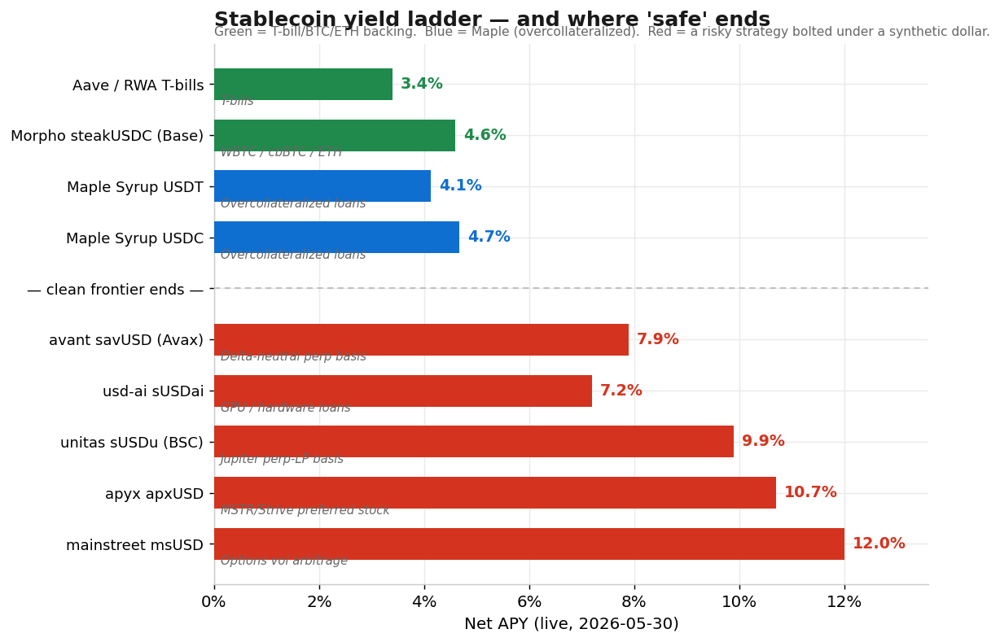
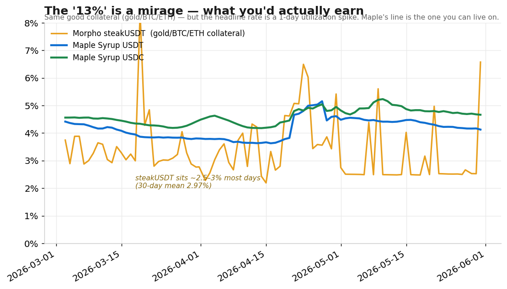
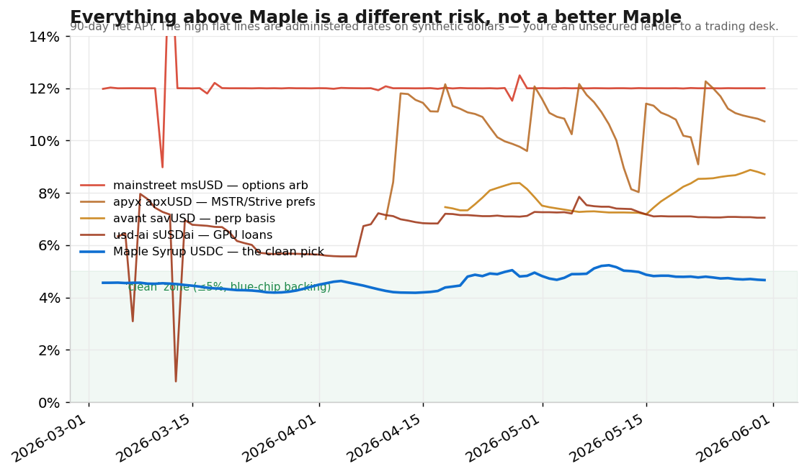

# Where to park USDT and USDC if you're conservative — May 2026

*I went looking for a safe 5%+ stablecoin yield. I came back with 4.7%. Here's the homework.*

> **TL;DR**
> - The honest no-shady-collateral rate on stablecoins is **~3.5–4.7%** right now. It tracks T-bills, because the safe pools are backed by tokenized treasuries or overcollateralized blue-chip loans.
> - My pick: **[Maple Syrup](https://syrup.fi)** — USDC at ~4.7%, USDT at ~4.1%. Real yield, no token emissions, billions in size.
> - Everything paying 5–13% is a synthetic dollar with a risky strategy underneath: GPU loans, options arbitrage, perp funding, or the preferred stock of leveraged Bitcoin-treasury companies. The higher APY isn't a better deal, it's a different risk.
> - The famous "13% backed by gold/BTC/ETH" Morpho vault is a mirage. The lived 30-day average is ~3%.

*Educational analysis, not advice. Numbers pulled live from [DefiLlama](https://defillama.com/yields) and the [Morpho API](https://api.morpho.org/graphql) on 2026-05-30. Rates move hourly; re-run the queries at the bottom.*

## The question

You hold stablecoins, you're conservative, and you want the underlying to be cash-equivalents, BTC, or ETH. Nothing else. Where do you deposit this month?

The front pages wave 8%, 12%, 17% at you. The job isn't finding a big number, it's knowing what sits underneath it, so you don't get paid for a risk you never meant to take. I screened every stablecoin pool above 5% across all chains, kept only real yield at real size, checked each one's 30-day history, then traced the actual collateral.

## Where "safe" ends



There's a clean line across the middle. Above roughly 4.7%, the backing stops being blue-chip. Green is T-bill, BTC, or ETH collateral; blue is Maple; red is a synthetic dollar earning from an active strategy. The whole top of the market has converged on the same spot: T-bill yield around 3.5%, plus a thin spread for overcollateralized lending up to ~4.7%. That's the no-shady rate. There is no safe 10%.

## The pick: Maple Syrup

| | APY | TVL | Backing |
|---|---|---|---|
| [**Maple Syrup USDC**](https://syrup.fi) | **4.67%** | $3.3B | Overcollateralized institutional loans |
| [**Maple Syrup USDT**](https://syrup.fi) | **4.13%** | $986M | Overcollateralized institutional loans |

Maple earns its spread by lending to vetted institutions who post more collateral than they borrow, not by holding junk. Single asset, no impermanent loss, `apyReward = 0` (so it's a real lending rate, not token bribes). One operational note: withdrawals route through a notice window, so check the cooldown before depositing.

Want collateral you can see on-chain? The runner-up is Morpho [`steakUSDC`](https://app.morpho.org/ethereum/vault/0xBEEF01735c132Ada46AA9aA4c54623cAA92A64CB) (~3.7–4.6%), which lends only against WBTC, cbBTC, and ETH.

## The trap: "13%, backed by gold and BTC"

The most tempting thing I found was a Morpho vault, Steakhouse USDT, that really does hold gold, BTC, and wstETH *and* flashes 13%. Blue-chip collateral and a double-digit rate. Looks perfect.



The collateral is genuinely good. The 13% is a one-day spike. On a normal day the vault sits at 2.5–3%, with a 30-day mean of 2.97%. Lending APY is borrow rate times utilization, and the rate only jumps when borrowers briefly max out the market. The moment they repay, or the moment you deposit and add supply, it falls back to ~2.5%. So the real comparison isn't 13% vs 4%. It's ~3% (what you'd actually earn) vs Maple's steady ~4.4%. Maple wins on both yield and stability, with collateral that's just as sound.

## Why I rejected every 5%+ option

The pools that *sustain* 5%+ aren't spikes; their lines are flat. But a flat 12% is its own warning. Real rates move, so a perfectly flat one is administered, which makes you an unsecured lender to whoever sets it.



| Protocol | APY | What's actually underneath | |
|---|---|---|---|
| mainstreet `msUSD` | ~12% | Options box-spread volatility arbitrage | ❌ |
| [apyx `apxUSD`](https://www.coindesk.com/markets/2026/05/29/strategy-s-strc-slips-below-usd99-as-strive-captures-investor-attention) | ~10.7% | Preferred stock of MSTR / Strive (slipped below par May 29) | ❌❌ |
| unitas `sUSDu` | ~9.9% | Jupiter perp-LP basis on Solana | ❌ |
| avant `savUSD` | ~7.9% | Delta-neutral perp basis (best audited) | ❌ least-bad |
| [usd-ai `sUSDai`](https://www.coindesk.com/business/2025/08/13/usd-ai-raises-usd13m-to-expand-gpu-backed-stablecoin-lending) | ~7.2% | Loans against GPUs (depreciating hardware) | ❌❌ |

Two earn extra caution. **apyx** is backed by the preferred equity of leveraged Bitcoin-treasury firms (Strategy's STRC, Strive's SATA). That's not BTC; it's an unsecured perpetual claim on companies whose dividend bills are outrunning their cash. [STRC slipped below par on May 29.](https://www.coindesk.com/markets/2026/05/29/strategy-s-strc-slips-below-usd99-as-strive-captures-investor-attention) **usd-ai** lends against [GPUs](https://www.coindesk.com/business/2025/08/13/usd-ai-raises-usd13m-to-expand-gpu-backed-stablecoin-lending), depreciating hardware tied to the exact AI-capex cycle a bubble-defensive investor is trying not to be levered to.

Watch the wording, too. Several of these say "1:1 backed by USDC." That's only the mint side. The yield comes from the risky layer on top, and a depeg starts there, not at the mint.

If you do want to reach, the least-bad is [avant](https://docs.avantprotocol.com/security/contract-and-opsec-audits): delta-neutral, audited by Trail of Bits and Omniscia, with a junior tranche taking losses ahead of senior depositors, live since July 2024. But that's a deliberate "+350bps for perp-basis and single-manager risk on Avalanche" bet, not a free lunch and not the conservative core.

## The checklist

Reject a stablecoin pool if any of these are true:

1. APY is mostly `apyReward` (emissions, not real yield).
2. TVL under ~$20M (the instant APY is noise).
3. Collateral is long-tail, PT, looped, or a reflexive synthetic.
4. Sustained APY well above ~6% on a "stablecoin."
5. A flat double-digit rate (administered, so you're an unsecured lender).

Keep it if: single asset, `apyReward ≈ 0`, TVL over $100M, collateral in {T-bills, BTC, ETH}, reputable curator.

## Check it yourself (free, no key, no wallet)

```bash
# Top no-shady stablecoin pools on Ethereum, real yield only:
curl -s https://yields.llama.fi/pools | jq -r '
  [.data[] | select(.chain=="Ethereum" and .stablecoin==true)
   | select(.tvlUsd>100e6) | select((.apyReward//0) < 0.5) | select(.apy<6)]
  | sort_by(-.apy) | .[]
  | "\(.project) [\(.symbol)] $\(.tvlUsd/1e6|floor)M  \(.apy)%"'

# Check a Morpho vault's actual collateral before depositing:
curl -s https://api.morpho.org/graphql -X POST -H 'Content-Type: application/json' \
  -d '{"query":"{ vaults(first:300,where:{chainId_in:[1]}){items{symbol state{netApy allocation{supplyAssetsUsd market{collateralAsset{symbol} lltv}}}}}}"}'
```

## Bottom line

[Maple Syrup USDC at ~4.7%](https://syrup.fi), or USDT at ~4.1%, with Morpho `steakUSDC` as the see-the-collateral alternative. Anything promising more is a different risk in a stablecoin costume, and in a market this late in the AI cycle, the last thing a defensive book needs is hidden leverage to GPUs and Bitcoin-treasury stock.

---

*Sources: [DefiLlama Yields](https://defillama.com/yields), [Morpho API](https://api.morpho.org/graphql), pulled 2026-05-30. Charts built from the raw API series ([script](make_charts.py)). Not financial advice. Verify before you deploy, and never hand your keys to a yield tool.*
