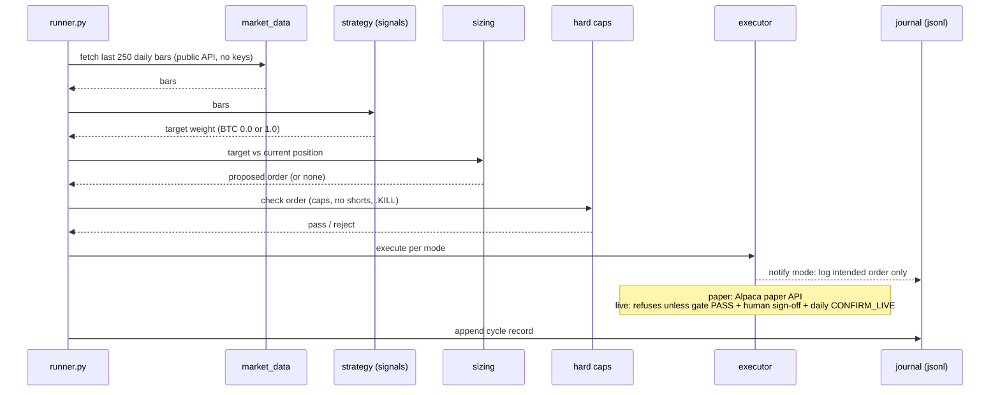

# Intraday Bot — Technical Design Document

Status: built, gated, and deployed 2026-07-01/02. Code: `intraday-bot/`. Results: [RESULTS.md](RESULTS.md). Notion mirror: [Intraday Bot](https://app.notion.com/p/391ac25eb49f80e1b1caebcbbcee3694).

## What we build

Two programs sharing one strategy codebase:

1. **A backtest gate** — a harness that decides whether a trading strategy is allowed to trade. It enforces the house law: no untested idea reaches an order.
2. **A trading daemon** — runs the exact same strategy file against live market data on a $500 crypto account, in three modes: `notify` (logs intended orders, touches no broker, needs no credentials), `paper` (Alpaca paper account), `live` (deliberately locked stub).

A strategy is one small Python file exposing `signals()`. The same file is imported by both the backtest and the daemon, so what we test is literally what trades.

## Goal

- Find a short-horizon crypto strategy that makes money **net of real costs** at $500 scale, prove it statistically, and only then let it near an order.
- Make validation reusable: any new idea drops in as one file and gets the full treatment with one command.
- Keep risk controls out of reach of both configuration and AI: hard caps compiled into code.

**Current status:** three candidates tested, **zero passed**. The daemon runs in notify mode on the mkt-daemon GCP VM, shadow-logging the best FAILed candidate to accumulate forward out-of-sample evidence. Nothing trades.

## Not goals

- Not high-frequency trading. We work on bars (5 minutes to 1 day), not ticks or order-book queues.
- Not US stock day-trading: a $500 account is blocked by the $2,000 margin minimum and next-day settlement, and prior equity intraday candidates all failed the gate anyway.
- No leverage, no shorts, no derivatives (funding-carry ideas are deferred for exactly this reason).
- Not a price-prediction engine or general screener; portfolio management for the main book lives elsewhere in this repo.
- Never auto-promote: `live` mode stays locked until a strategy passes the gate **and** a human signs off. Design invariant, not a config default.

## Architecture overview

```
backtest/
  connectors/            shared risk layer (pre-existing, reused as-is)
    hard_caps.py         deterministic order checks + .KILL kill-switch
    notify_executor.py   notification-first execution, live-gate pattern
  intraday-bot/
    core/
      data.py            Binance Vision downloader/loader (timestamp-unit hard assert, gap backfill)
      costs.py           fee model: 0.15% maker / 0.25% taker, min-fee floor, stress multipliers
      fills.py           deterministic maker-fill simulator (see Algorithms)
      gate.py            the gate: IS/OOS split, walk-forward, deflated Sharpe, regimes, stress, verdict
      universe.py        point-in-time universe builder (survivorship defense)
    strategies/          one file per strategy; signal logic ONLY — no execution code allowed here
    scripts/             per-strategy gate runners, charts, harness self-test, data download
    results/ reports/    machine-readable gate outputs + human write-ups
    bot/
      runner.py          hourly daemon loop
      market_data.py     public bars via alpaca-py, ccxt fallback
      sizing.py          target weight -> order diff
      caps.py            $500-book caps, hardcoded: order<=$250, position<=$500, daily loss<=$25, no shorts
      executor.py        notify | paper | live-gated
      state/             append-only jsonl journals (orders, positions, cycles); idempotent restart
    deploy/              systemd unit + GCP setup script + runbook
```

The design decision that matters most: **strategies cannot cheat.** They output target positions from prior-bar data only; the harness owns all execution simulation (fills, costs, timing) and runs anti-cheating tests against every strategy (see "How we backtest").

## Sequence diagram

Live cycle, notify mode (hourly). The backtest is the same flow with `core/fills.py` simulating the exchange bar-by-bar from historical data.



## Technologies we use

- **Python 3.10+** (pandas, numpy) — one language so backtest and live share code; matches the repo's data stack.
- **Data:** Binance Vision public kline dumps (free, 6+ years of 5m/1h/1d history); ccxt for cross-checks; alpaca-py for live public bars.
- **Broker (when a strategy earns it):** Alpaca crypto — cheapest at small size (0.15% maker / 0.25% taker), official Python SDK, free paper accounts.
- **Tests:** pytest, 63 tests — data parsing, fill mechanics, cost math, gate logic, universe construction.
- **Ops:** systemd on a GCP e2-micro (shared mkt-daemon VM), journald logs, no database — append-only jsonl journals.
- **No off-the-shelf backtesting framework:** none model resting-limit-order fill realism honestly; a small custom harness does, and is fully unit-tested.

## Algorithms we use

Strategies tested (all through the gate):

| Strategy | Idea | OOS Sharpe (net of costs) | vs hold-BTC (0.41) | Verdict |
|---|---|---|---|---|
| `regime_sma_maker` | Long BTC when yesterday's close > 50-day average, else flat; maker-limit execution | **+0.58**, maxDD −28% vs −53% | beats | **FAIL** — statistical significance only (DSR z ≈ −15); honest delayed-fill sim also goes negative |
| `xs_momentum` | Weekly: rank point-in-time top-30 coins by 28d return, hold top-5 | −0.57 | loses | **FAIL** — overfit (IS +1.77 → OOS sign flip); loses to holding the same coins |
| `meanrev_maker` | Rest a limit buy k std-devs below a 5m rolling mean, exit at the mean or timeout | −10.3 | loses catastrophically | **FAIL** — negative edge *before fees*; execution layer itself validated |

Supporting algorithms:

- **Maker-fill simulation** (`core/fills.py`): a resting limit fills only if price trades *through* it by ≥1bp — a touch is not a fill. Queue-position haircut via a stricter trade-through stress tier; adverse selection measured as next-bar drift after every fill; unfilled entries are skipped and counted; unfilled exits escalate to market at taker fee. Deterministic — zero randomness, byte-identical reruns.
- **Deflated Sharpe Ratio** (Bailey & López de Prado): penalizes the result by the number of configurations tried ("flip enough coins and one looks like a genius"); the gate requires ≥95% confidence the edge isn't luck.
- **Hard caps** (`bot/caps.py` + `connectors/hard_caps.py`): pure-function order checks outside config and outside any AI; a `.KILL` file halts trading within one cycle.

## How we backtest (the gate)

Every stage mandatory; skipping any = the run doesn't count.

1. **Spec** — the strategy is written as a falsifiable contract first: entry, exit, sizing, and the one economic reason someone is on the other side of the trade.
2. **Data** — point-in-time only. In-sample 2020–2023, out-of-sample 2024–mid-2026, split fixed before any tuning.
3. **Declared grid** — all configs listed before running; tuned on in-sample only; every config tried counts toward the significance penalty.
4. **Walk-forward** — refit on rolling 12-month windows, score only the next 3 months; the concatenated out-of-sample series is the headline number.
5. **Stress** — each tier a full independent rerun: 2× fees, all fills delayed one bar, reduced fill probability, extra slippage on the most volatile bars.
6. **Regimes** — 2021 bull, 2022 LUNA/FTX, 2023–24 recovery, 2025 drawdown, 2026 YTD.
7. **Verdict** — PASS only if OOS Sharpe > 0 **and** deflated Sharpe ≥ 0.95 **and** both stress tiers survive. "No edge found" is a valid, valuable result.

Anti-self-deception measures (each caught a real bug in this build):

- **Look-ahead canary:** a fake price spike planted in a bar must not change any signal at or before that bar.
- **Shift-collapse test:** one extra bar of delay must not collapse performance — if it does, the signal was peeking at the future.
- **Independent adversarial verification:** a separate reviewer who didn't write the code re-runs everything from scratch, recomputes the math by hand, and tries to refute the verdict. This caught a P0 (fill-sim P&L ignored fill prices — the fix *revealed* a delayed-fill failure the bug had masked), a survivorship bug in the universe builder, and a month-long data gap.
- **Dead-idea log** (`backtests/results/intraday_bot_summary.txt`): every FAIL recorded with exact assumptions so it is never blindly re-tested.
- **The iron rule:** never loosen costs, fill assumptions, or date windows to manufacture a PASS. That is reward-hacking the gate.

## Other important things

- **Costs are the boss.** The June 2026 test round died at 0.5%/side taker fees; this round used honest maker economics (0.30% round trip) and the ideas still failed. Every candidate must state its break-even edge per trade up front.
- **Promotion path:** gate PASS → human reviews RESULTS.md → `paper` mode (Alpaca paper keys) → a separate human decision + daily `CONFIRM_LIVE` env var → `live`. Every arrow is a human action.
- **Deployment:** `intraday-bot.service` on the mkt-daemon VM (IP is ephemeral — connect via `gcloud compute ssh`), notify mode, zero credentials on the box. Ops: `journalctl -u intraday-bot -f`; emergency stop: `touch /opt/intraday-bot/intraday-bot/.KILL`. Runbook: `docs/infra.md`.
- **Data gotchas, encoded as tests:** Binance switched kline timestamps from milliseconds to microseconds in 2025 files (hard assert — a misparse raises, never silently shifts); monthly dumps lag ~1 month (daily-endpoint backfill); delisted coins must stay in the historical universe or momentum results inflate.
- **Known limits:** strategy params are global, not per-symbol (the ETH leg was dropped from the shadow run because BTC wants a 50-day window and ETH a 200-day one); multi-year intraday equity data isn't freely available, one more reason equities are out of scope.
- **What would change our mind:** fresh out-of-family evidence for the trend filter on a pre-registered symbol set (the shadow deployment collects exactly this), or a genuinely new signal family. More re-tuning of failed families only raises the statistical bar they already missed.

## End product goal

**The end product is an unattended service on the GCP VM that trades a gate-PASSED strategy on a $500 Alpaca crypto live account, within hardcoded risk caps, with a paper track record proving that live behavior matches the backtest, and a daily P&L report reaching the owner.**

One sentence per success dimension:
- **Profitable:** positive net P&L after all fees over a meaningful live window — or an honest, evidenced shutdown decision.
- **Proven:** every layer (signal, fills, costs, risk) validated before real money touches it.
- **Safe:** worst realistic day loses ≤ $25 (the daily-loss kill), worst realistic total loss is capped at $500.
- **Unattended:** survives restarts, needs no babysitting, can be halted with one file (`.KILL`).

## Readiness checklist

The product is ready for live money only when **every** box is checked, **in order**. No stage may borrow from a later one.

**Stage 1 — Strategy validated (the gate)** — status: ❌ blocking, 0/3 candidates passed
- [ ] A strategy shows out-of-sample Sharpe > 0, net of costs
- [ ] Deflated Sharpe ≥ 0.95 (significant after counting every configuration tried)
- [ ] Survives all stress tiers: 2× fees, 1-bar delayed fills, reduced fill probability, worst-volatility slippage
- [ ] Beats buy-and-hold of the same asset on risk-adjusted return over the same window
- [ ] Independent adversarial verifier reproduces every headline number from committed code + data and finds no look-ahead
- [ ] Human reads RESULTS.md and signs off on promotion to paper

**Stage 2 — Paper track record (Alpaca paper account, real market, fake money)**
- [ ] ≥ 60 days of unattended paper operation with zero crashed cycles and zero manual interventions
- [ ] Paper fill prices within the backtest fill-model assumptions (slippage audit — measured, not assumed)
- [ ] Paper equity curve inside the backtest's expectation band (no unexplained divergence)
- [ ] Zero hard-cap violations; restart-idempotence observed in practice (service restarted, state replayed correctly)
- [ ] Kill switch exercised at least once in paper

**Stage 3 — Live readiness (ops + risk)**
- [ ] Hard caps re-verified in code review: order ≤ $250, position ≤ $500, daily loss ≤ $25, no shorts, `.KILL` honored
- [ ] Secrets in Bitwarden (`dev` collection), mirrored to `/etc/intraday-bot.env` on the VM, never in git
- [ ] Daily heartbeat + P&L notification reaching the owner (not just server logs)
- [ ] Runbook current in `docs/infra.md`: deploy, upgrade, halt, rollback
- [ ] Owner sets live keys + `CONFIRM_LIVE` — the final, explicit, daily-renewed go decision

**Stage 4 — Judged in production (after 90 days live)**
- [ ] Net P&L ≥ 0 after fees
- [ ] Realized drawdown never exceeded backtest max drawdown + 10% buffer
- [ ] Live behavior matched paper (fills, turnover, exposure)
- If any box fails → halt, write the post-mortem into the dead-idea log, return to research. A losing bot that keeps running is a bug.

**Where we are today (2026-07-02):** Stage 1 is not passed — all three candidates FAILed the gate, so Stages 2–4 are blocked by design. The deployed notify-mode shadow run is pre-Stage-2 evidence gathering; it costs nothing and risks nothing. The next unlock is a strategy that clears Stage 1.
