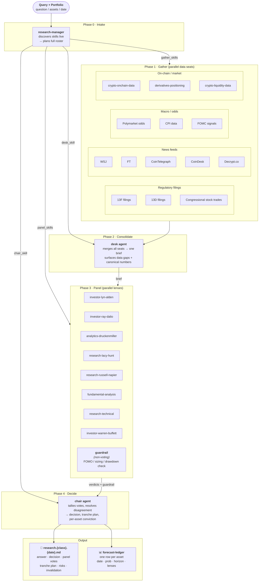

# research-market workflow diagram

## Phase summary

| Phase | What runs | Parallel? |
|---|---|---|
| **Intake** | research-manager (discovers skills live, plans roster) | no |
| **Gather** | N data seats (filings + news + macro + on-chain) | yes |
| **Consolidate** | 1 desk agent → single canonical brief | no |
| **Panel** | M lens agents + 1 non-voting guardrail | yes |
| **Decide** | 1 chair agent → structured decision | no |
| **Write** | write-report + verify (retry once) | no |
| **Ledger** | 1 row per asset via `ledger.py` | yes |

> N and M are **not hardcoded** — the manager picks them fresh each run based on the query, available skills, and asset class.
